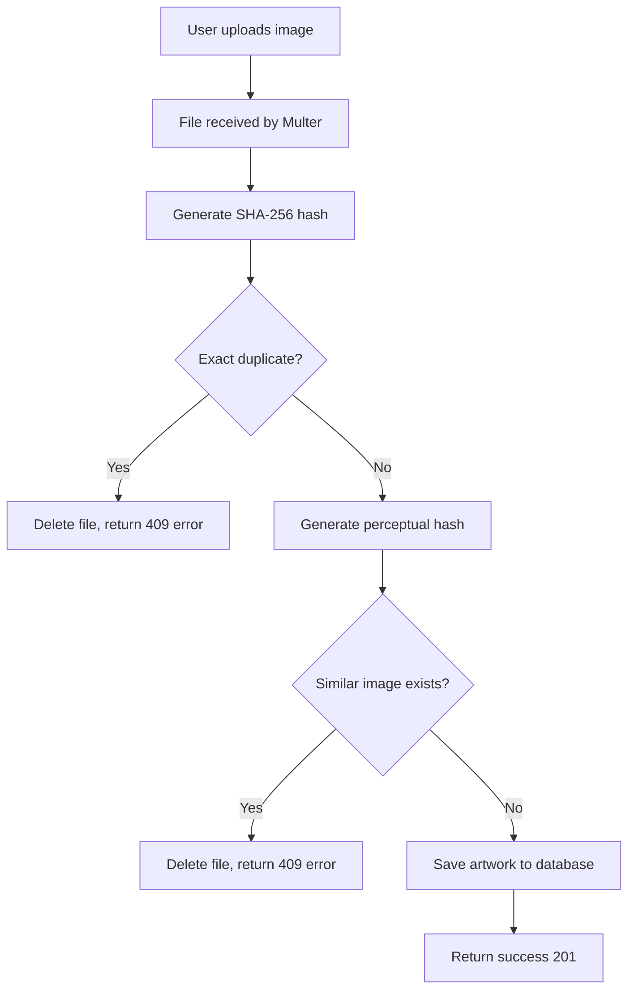

# Duplicate Image Detection System

## Overview
This system prevents duplicate and similar images from being uploaded to the artwork gallery using SHA-256 hashing for exact duplicates and perceptual hashing (pHash) for visually similar images.

## Features

### 1. Exact Duplicate Detection
- **Algorithm**: SHA-256 cryptographic hash
- **Use Case**: Prevents uploading the exact same image file
- **Detection**: Works even if filename is changed
- **Performance**: O(1) lookup using MongoDB unique index

### 2. Similar Image Detection
- **Algorithm**: Difference Hash (dHash) - a type of perceptual hash
- **Use Case**: Detects visually similar images (slight edits, crops, filters)
- **Threshold**: Hamming distance ≤ 8 (configurable)
- **Performance**: O(n) comparison with recent uploads (limited to 1000)

## Architecture

### Components

```
backend/
├── models/
│   └── Artwork.js              # Updated schema with hash fields
├── utils/
│   └── imageHash.js            # Hash generation utilities
├── routes/
│   └── artworks.js             # Upload controller with detection
└── migrations/
    └── addImageHashes.js       # Migration for existing data
```

### Database Schema

```javascript
{
  // ... existing fields ...
  imageHash: {
    type: String,
    required: true,
    unique: true,      // Prevents exact duplicates
    index: true        // Fast lookups
  },
  perceptualHash: {
    type: String,
    index: true        // Fast similarity searches
  }
}
```

### Indexes

```javascript
// Unique index for exact duplicate prevention
{ imageHash: 1 } (unique)

// Index for similar image detection
{ perceptualHash: 1 }

// Compound index for artist queries
{ artist_id: 1, created_at: -1 }
```

## How It Works

### Upload Flow



### Hash Generation

**SHA-256 (Exact Duplicate)**
```javascript
const imageHash = crypto
  .createHash('sha256')
  .update(fileBuffer)
  .digest('hex');
// Output: "a1b2c3d4e5f6..." (64 characters)
```

**Perceptual Hash (Similar Images)**
```javascript
1. Resize image to 9x8 pixels
2. Convert to grayscale
3. Compare adjacent pixels (left vs right)
4. Generate 64-bit binary hash
5. Convert to hexadecimal
// Output: "1f3a5b7c9d2e4f6a" (16 characters)
```

### Similarity Detection

**Hamming Distance Calculation**
```javascript
// Compare two perceptual hashes
hash1: "1f3a5b7c9d2e4f6a"
hash2: "1f3a5b7c9d2e4f7b"

// Convert to binary and count different bits
distance = 2 // Only 2 bits different

// Threshold check
if (distance <= 8) {
  // Images are similar
}
```

## API Responses

### Success Response
```json
{
  "success": true,
  "message": "Artwork uploaded successfully! 🎨",
  "artwork": {
    "_id": "...",
    "title": "...",
    "imageHash": "a1b2c3d4...",
    "perceptualHash": "1f3a5b7c..."
  }
}
```

### Exact Duplicate Error
```json
{
  "success": false,
  "message": "This image has already been uploaded. Duplicate images are not allowed.",
  "duplicateArtwork": {
    "id": "...",
    "title": "Original Title",
    "uploadedAt": "2024-01-15T10:30:00Z"
  }
}
```

### Similar Image Error
```json
{
  "success": false,
  "message": "A very similar image has already been uploaded. Please upload a different artwork.",
  "similarArtwork": {
    "id": "...",
    "title": "Similar Artwork",
    "uploadedAt": "2024-01-15T10:30:00Z"
  }
}
```

## Installation & Setup

### 1. Install Dependencies
```bash
cd backend
npm install sharp
```

### 2. Run Migration (For Existing Data)
```bash
node backend/migrations/addImageHashes.js
```

This will:
- ✅ Generate hashes for existing artworks
- ✅ Create necessary indexes
- ✅ Detect and report duplicates
- ✅ Skip files that don't exist

### 3. Environment Variables
No additional environment variables required. Works out of the box!

## Configuration

### Adjust Similarity Threshold

In `backend/routes/artworks.js`:

```javascript
// Current threshold: 8 (strict)
areSimilarImages(perceptualHash, artwork.perceptualHash, 8)

// More lenient (allows more variation): 12
areSimilarImages(perceptualHash, artwork.perceptualHash, 12)

// Very strict (almost identical): 5
areSimilarImages(perceptualHash, artwork.perceptualHash, 5)
```

**Recommended Thresholds:**
- **5**: Very strict - only near-identical images
- **8**: Balanced - good for artwork galleries (default)
- **12**: Lenient - allows more variation
- **15+**: Too lenient - may allow clearly different images

### Disable Similar Image Detection

To only use exact duplicate detection:

```javascript
// Comment out or remove this section in artworks.js
/*
if (perceptualHash) {
  // Similar image check code...
}
*/
```

## Performance Considerations

### Exact Duplicate Detection
- **Database Query**: O(1) with unique index
- **Hash Generation**: ~10-50ms for 5MB image
- **Storage**: 64 bytes per artwork (imageHash)

### Similar Image Detection
- **Database Query**: O(n) - limited to 1000 recent artworks
- **Hash Generation**: ~50-200ms for 5MB image (includes resizing)
- **Comparison**: ~1ms per artwork
- **Storage**: 16 bytes per artwork (perceptualHash)

### Optimization Tips

1. **Limit comparison scope** (already implemented)
   ```javascript
   .limit(1000) // Only compare with recent uploads
   ```

2. **Index perceptualHash** (already implemented)
   ```javascript
   artworkSchema.index({ perceptualHash: 1 });
   ```

3. **Cache recent hashes** (future enhancement)
   - Use Redis to cache recently checked hashes
   - Reduces database queries

## Error Handling

### File Cleanup
Uploaded files are automatically deleted if:
- ❌ Validation fails
- ❌ Duplicate detected
- ❌ Similar image detected
- ❌ Any error occurs during save

### MongoDB Duplicate Key Error
```javascript
if (error.code === 11000 && error.keyPattern?.imageHash) {
  // Handle race condition where two identical uploads happen simultaneously
  return res.status(409).json({
    success: false,
    message: 'Duplicate image detected'
  });
}
```

## Testing

### Manual Testing

**Test Exact Duplicate:**
```bash
# Upload same image twice
curl -X POST http://localhost:5000/api/artworks/upload \
  -H "Authorization: Bearer YOUR_TOKEN" \
  -F "image=@test-image.jpg" \
  -F "title=Test Artwork" \
  -F "category=digital" \
  -F "price=1000"

# Second upload should fail with 409 error
```

**Test Similar Image:**
1. Upload original image
2. Slightly edit the image (e.g., add small text)
3. Upload edited version
4. Should detect as similar and reject

### Automated Testing

```javascript
// backend/tests/duplicate-detection.test.js
describe('Duplicate Detection', () => {
  test('should reject exact duplicate', async () => {
    // Upload once
    const response1 = await uploadArtwork(imageBuffer);
    expect(response1.status).toBe(201);

    // Upload again
    const response2 = await uploadArtwork(imageBuffer);
    expect(response2.status).toBe(409);
    expect(response2.body.message).toContain('already been uploaded');
  });
});
```

## Monitoring

### Log Analysis
```bash
# Check duplicate detection logs
grep "duplicate detected" logs/app.log

# Check perceptual hash performance
grep "Generated perceptual hash" logs/app.log
```

### Database Queries
```javascript
// Count artworks with hashes
db.artworks.count({ imageHash: { $exists: true } })

// Find artworks without hashes (should be 0 after migration)
db.artworks.find({ imageHash: { $exists: false } }).count()

// Check duplicate hashes (should be 0)
db.artworks.aggregate([
  { $group: { _id: "$imageHash", count: { $sum: 1 } } },
  { $match: { count: { $gt: 1 } } }
])
```

## Security Considerations

1. ✅ **Hash Collision Resistance**: SHA-256 is cryptographically secure
2. ✅ **File Cleanup**: Prevents disk space exhaustion
3. ✅ **Index Performance**: Prevents DoS via slow queries
4. ✅ **Error Messages**: Don't expose internal paths

## Future Enhancements

### Recommended Improvements

1. **Redis Caching**
   - Cache recently checked hashes
   - Reduce database load

2. **Background Processing**
   - Generate perceptual hash asynchronously
   - Faster upload response times

3. **Advanced pHash Algorithms**
   - Use more sophisticated algorithms (e.g., DCT-based pHash)
   - Better detection of rotated/scaled images

4. **Admin Dashboard**
   - View detected duplicates
   - Manually approve similar images
   - Adjust thresholds per category

5. **Machine Learning**
   - Use deep learning for semantic similarity
   - Detect different photos of same artwork

## Troubleshooting

### Issue: Migration fails with "File not found"
**Solution**: Some artworks may reference deleted images. The migration skips these automatically.

### Issue: Perceptual hash returns null
**Solution**: Image format may not be supported by Sharp. Falls back to exact duplicate detection only.

### Issue: Too many false positives (similar images rejected incorrectly)
**Solution**: Increase threshold in `areSimilarImages()` from 8 to 12.

### Issue: Duplicates not detected
**Solution**: Ensure indexes are created by running the migration script.

## Support

For issues or questions:
1. Check logs for detailed error messages
2. Verify indexes are created: `db.artworks.getIndexes()`
3. Test hash generation: Use utilities in `utils/imageHash.js`
4. Review migration output for warnings

---

**Version**: 1.0.0  
**Last Updated**: February 2026  
**Dependencies**: sharp ^0.33.0, crypto (built-in)
